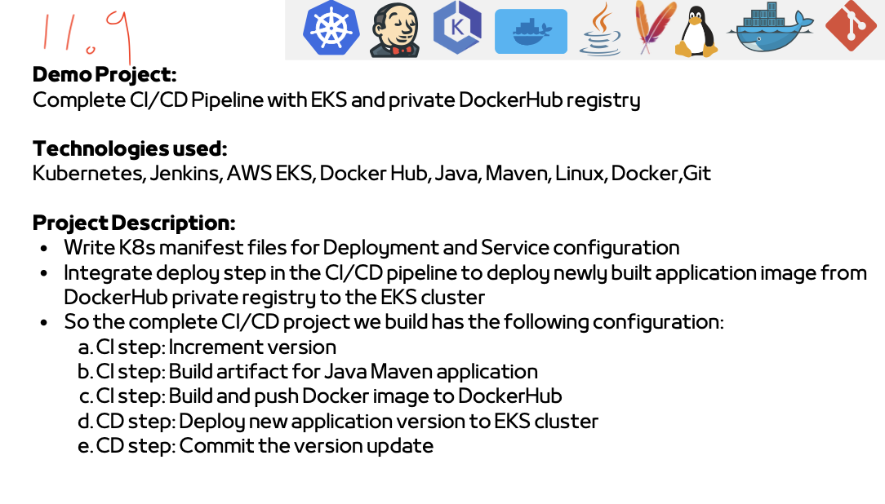
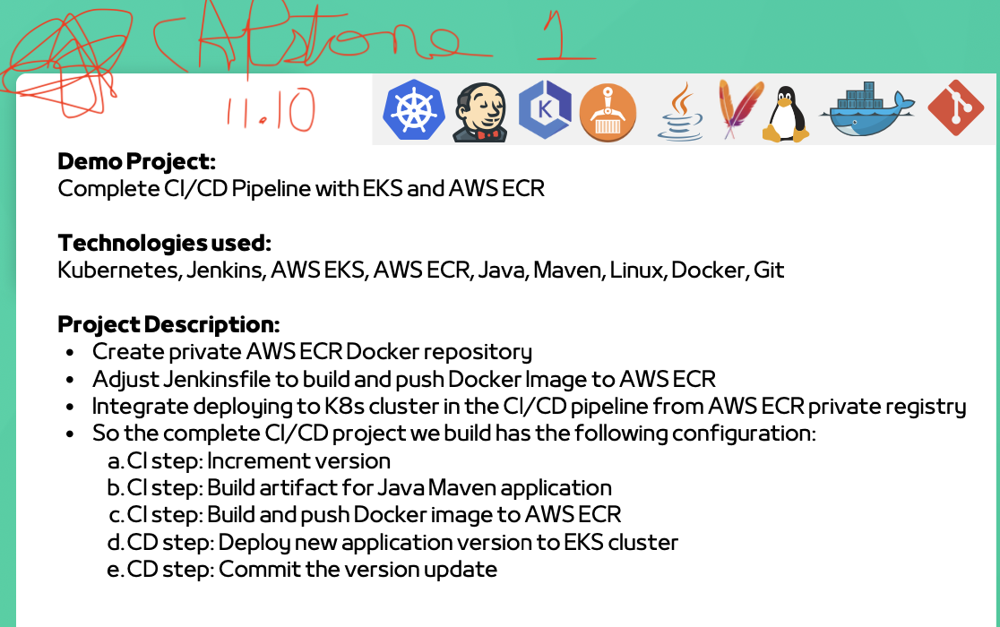

# **11.9 - Complete CI/CD Pipeline with EKS and DockerHub**

- **Demo executed - Complete CI/CD Pipeline with DockerHub:**
    - Created Deployment and Service for App deployment
    - Adjust Jenkinsfile to set environment variables with *envsubst*
    - Installed “gettext-base” tool inside Jenkins Container on DigitalOcean Server to have envsubst available
    - Created Secret for DockerHub Registry in EKS cluster (connect to EKS cluster if not already) and added reference to Deployment file
    - Executed Jenkins Pipeline
  

# **11.10 - Complete CI/CD Pipeline with EKS and ECR**

- **Demo executed - Complete CI/CD Pipeline with AWS ECR:**
    - Created ECR Repository
    - Created Credential for ECR repository in Jenkins
    - Created Secret for AWS ECR Registry in EKS cluster and adjusted reference in Deployment file
    - Updated Jenkinsfile
    - Executed Jenkins Pipeline
  

## Repo

 - Repo used is https://github.com/Cristian-Baeza/java-maven-app/tree/jenkins-jobs on 'jenkins-jobs' branch
 - Most relevant file copies included here. 

