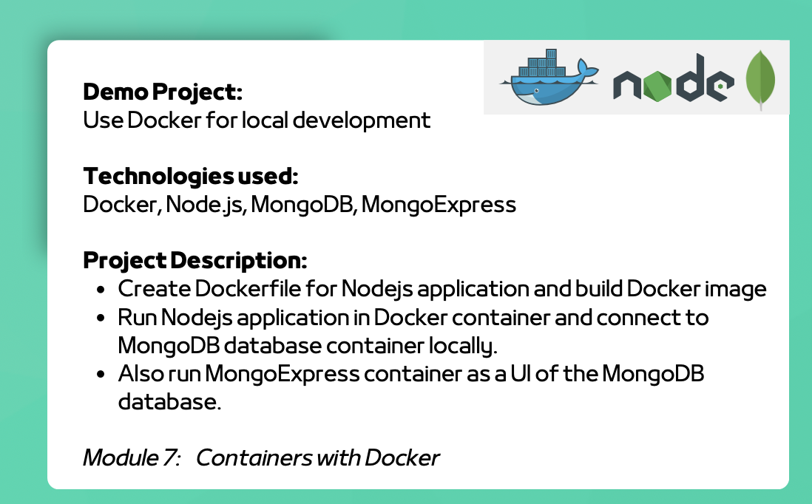

# Project Description

1. Git cloned example git project
2. Pulled MongoDB image
3. Pulled mongo-express image
4. Created mongo-network
5. Started MongoDB container with all necessary parameters
    #### Example Parameters

```bash
docker run -p 27017:27017 -d -e MONGO_INITDB_ROOT_USERNAME=admin -e MONGO_INITDB_ROOT_PASSWORD=password --name mongodb --net mongo-network mongo
```
6. Started mongo-express container with all necessary parameters 
7. Created new database via Mongo Express UI
8. Configured Node.js application code to connect with database



