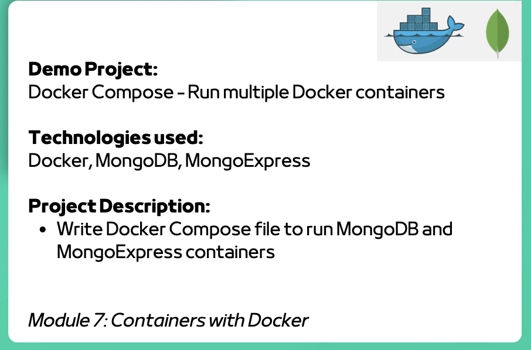

# Project Description

1. Installed Docker Compose (should already be installed with Docker Desktop):
2. Created a `docker-compose` file to start MongoDB and mongo-express containers instead of using `docker run`
3. Created a new database

Used same app as 7.1. Instead of running mongo using `docker run` from CLI, this time I used a YAML file and ran it using

`docker compose -f mongo.yaml up`

